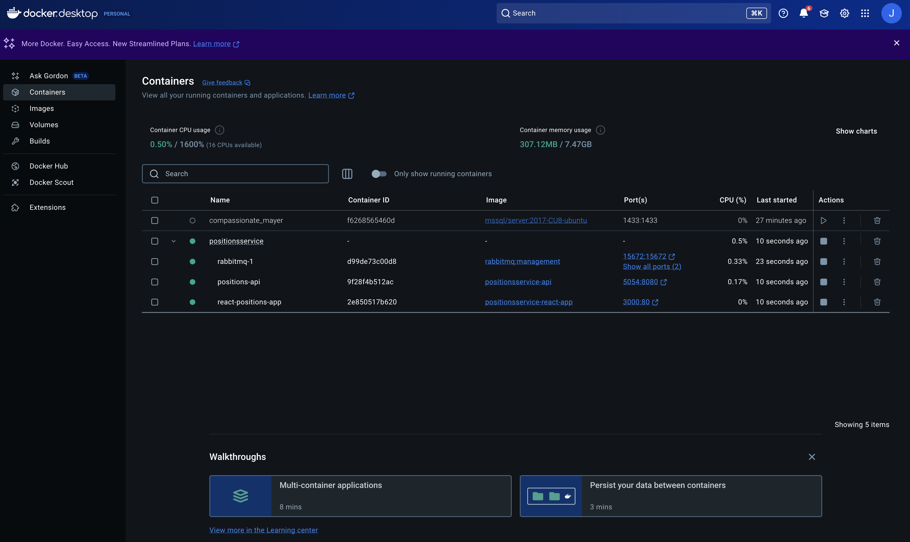
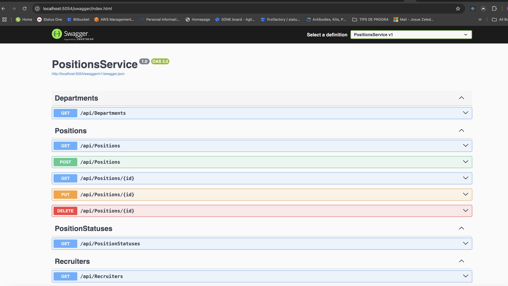
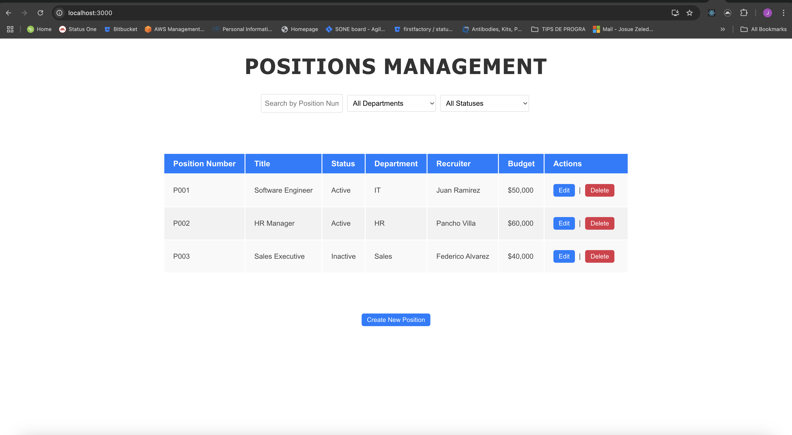

# Positions Service

Positions Service is a web application built with React for the frontend, .NET Core for the backend API, and RabbitMQ for messaging. This application helps manage job positions, departments, and statuses.

## Technologies Used

- **Frontend**: React
- **Backend**: .NET Core
- **Database**: Not defined (Could be added as needed)
- **Messaging**: RabbitMQ
- **Real-time communication**: SignalR

## Features

- Manage positions, departments, and their statuses.
- Real-time updates via SignalR when a position is updated.
- User-friendly interface for searching and filtering positions.

## Setup

To run the application locally, you need to have Docker installed.

### 1. Clone the repository

```bash
git clone https://github.com/JosueZeledon0727/PositionsService.git
```

### 2. Navigate to the project directory

```bash
cd PositionsService
```

### 3. Build and start the application with Docker Compose

```bash
docker-compose up --build
```
This will start the following services:

- **RabbitMQ** running on http://localhost:15672
- **.NET Core API** running on http://localhost:5054
- **React App** running on http://localhost:3000


### 4. Access the application
Open your browser and navigate to http://localhost:3000 to access the React app.

## Screenshots

1. **Docker Desktop with Containers Running**

   This screenshot shows the Docker Desktop interface with all the containers for the React app, API, and RabbitMQ running.

   

2. **Swagger UI**

   This screenshot shows the Swagger UI, which is used to test and explore the available API endpoints for the .NET Core backend.

   

3. **React App Running**

   This screenshot shows the React app running in the browser, where you can interact with the positions and other data.

   